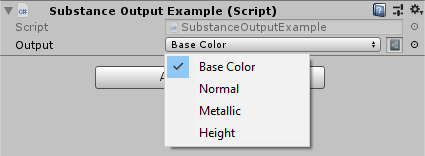
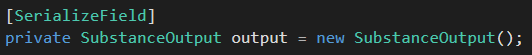

SubstanceOutput
----------------------------

Makes selecting Substance output IDs much easier by creating a dropdown for a referenced SubstanceGraph's outputs.

### Code
SubstanceOutput is a serialized class that allows for easy selection of a SubstanceGraph's output IDs. To use it, add a public or serialized variable of type SubstanceOutput to your class.

This will allow you to select from a target SubstanceGraph's outputs.
