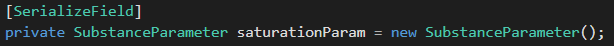
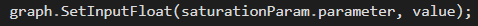
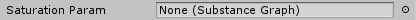
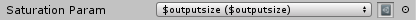
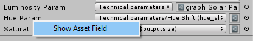

SubstanceParameter
----------------------------

Makes selecting Substance input parameters much easier by creating a dropdown for a referenced SubstanceGraph's inputs. Parameters can be grouped to produce nested dropdown options.

### Code
SubstanceParameter is a serialized class that allows for easy selection of a SubstanceGraph's input parameters. To use it, add a public or serialized variable of type SubstanceParameter to your class.

This will allow you to select from a target SubstanceGraph's input parameters. To actually access the parameter name, use the `.parameter` variable of the SubstanceParameter.

### Inspector
Once you have declared a SubstanceParameter variable, you will see the following field:

Drag a SubstanceGraph into the field to select from its parameters.

You can right click on SubstanceParameter field labels to show/hide the graph being referenced. This is mostly so developers can easily see which SubstanceGraph assets are being referenced per field.

