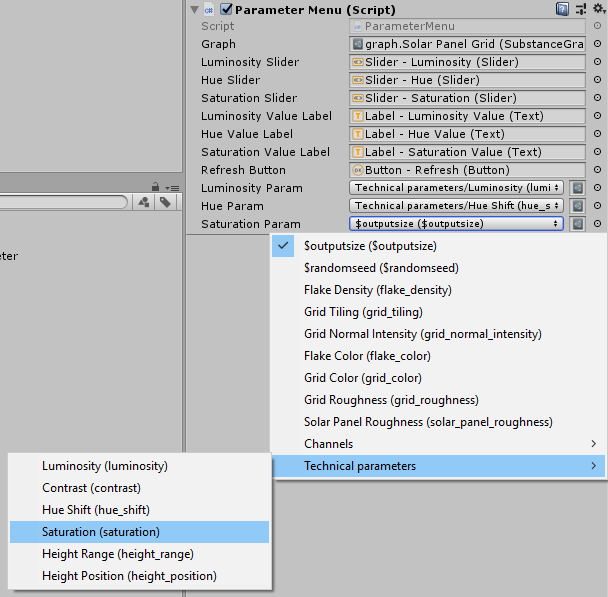

SubstanceParameter
----------------------------

Makes selecting Substance input parameters much easier by creating a dropdown for a referenced SubstanceGraph's inputs. Parameters can be grouped to produce nested dropdown options.

### Use
SubstanceParameter is a serialized class that allows for easy selection of a SubstanceGraph's input parameters.

