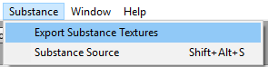
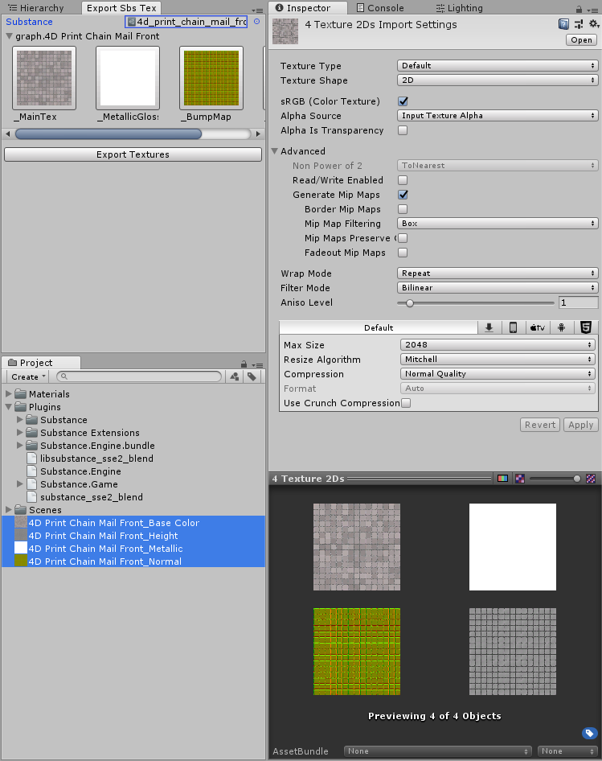

Export Substance Textures Window
--------------------------------
Allows textures embedded into Substance files to be exported as standalone .PNG files. This supports both compressed and uncompressed textures.

### Opening the tool
To open the Export Substance Textures window, select "Substance => Export Substance Textures" from Unity's menu bar.

### Exporting Textures
To export a substance's textures, drag a substance .sbsar asset into the window's "Substance" field. The window will show all texture outputs for that substance, grouped by graph. Click the "Export Textures" button to select the target folder then your textures will be exported there. If the target folder is inside of the Assets folder, the textures will automatically be imported and selected after exporting.

