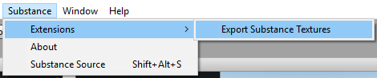
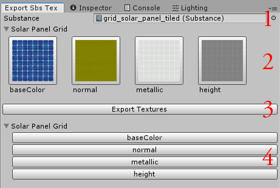

Export Substance Textures Window
-----------------------------------------------
Allows textures embedded into Substance files to be exported as standalone .PNG files. This supports both compressed and uncompressed textures.

### Opening the tool
To open the Export Substance Textures window, select "Substance => Extensions => Export Substance Textures" from Unity's menu bar.

### The Export Substance Textures Window

The window is broken up into 4 main sections, as shown above.

<b>1. The substance field</b>

This contains a reference to the substance asset you want to export textures from.

<b>2. The substance graph texture preview area</b>

This area displays all of the texture outputs of the target substance, grouped by graph.

<b>3. The export textures button</b>

Clicking this button will export all of the substance's textures to a folder of your choosing. This can be inside or outside of the Unity project. If you export the textures inside the project, they will be imported and selected automatically.

<b>4. The individual export area</b>

This area lets you export individual textures from the substance.

### Exporting Textures
To export a substance's textures, drag a substance .sbsar asset into the window's "Substance" field. The window will show all texture outputs for that substance, grouped by graph. Click the "Export Textures" button to select the target folder then your textures will be exported there. Alternatively, you can export an individual texture to a specific location of your choosing. If the target folder is inside of the Assets folder, the textures will automatically be imported and selected after exporting.
